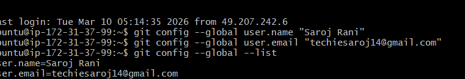

Project Name:  Git-Nginx Assessment  
Name: Saroj Rani
First update ubuntu vm with sudo apt upate and then installed git by using command
 sudo apt install git -y
 Then checked version 
 git --version
 Version received:
 git version 2.43.0

[git --version](image.png)

Configured git on Ec2 vm 
git config --global user.name "SAroj Ranir"
git config --global user.email "techiesaroj14@gmail.com"

Checked global  configuration by 
git config --global --list
output
user.name=Saroj Rani
user.email=techiesaroj14@gmail.com

Added calculator module with add() and sub()
